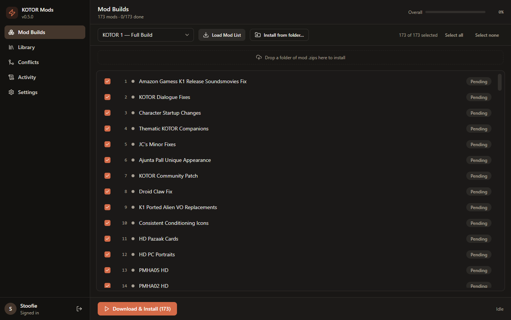
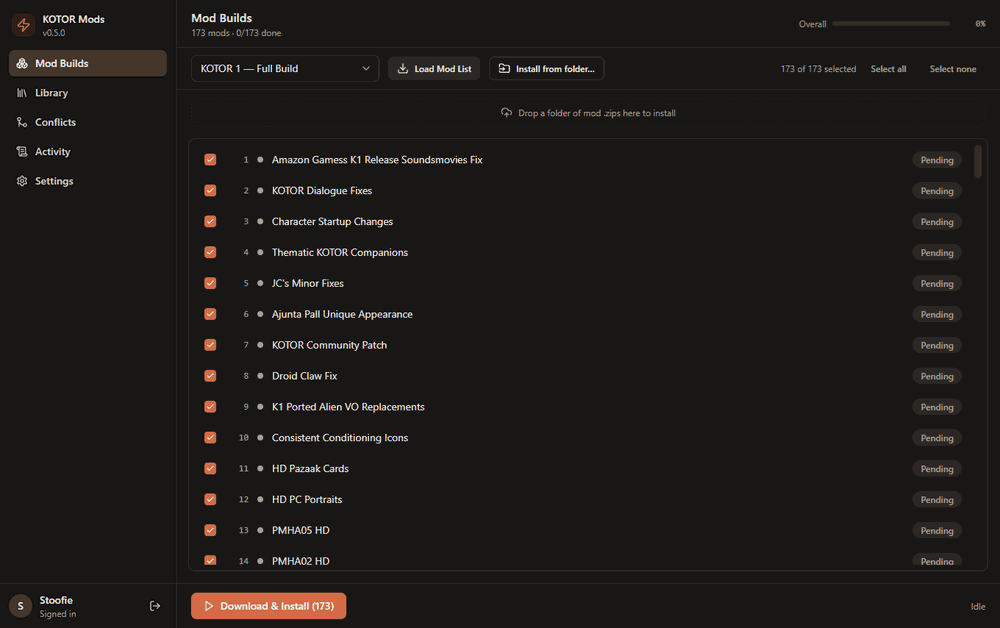
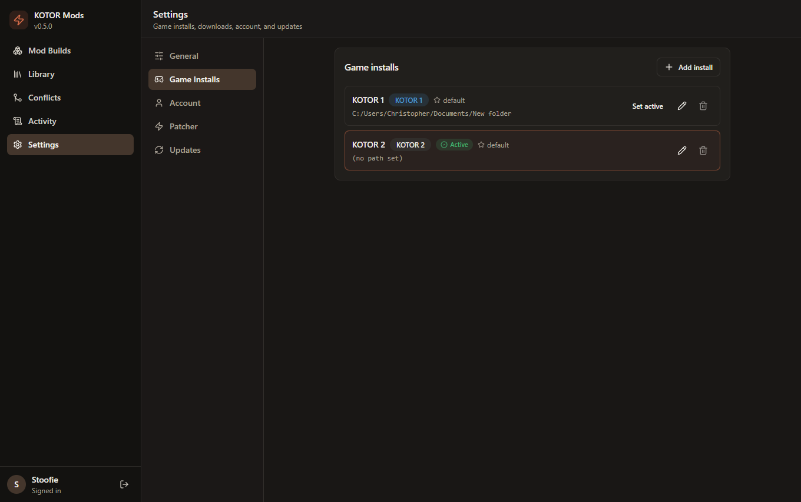
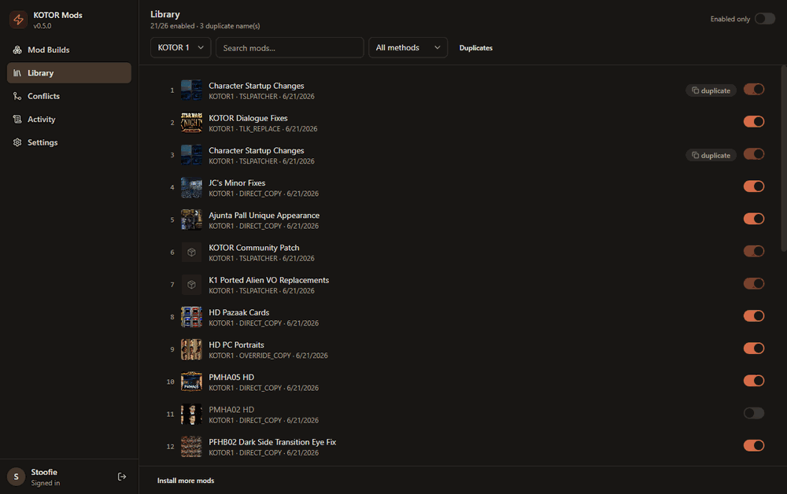
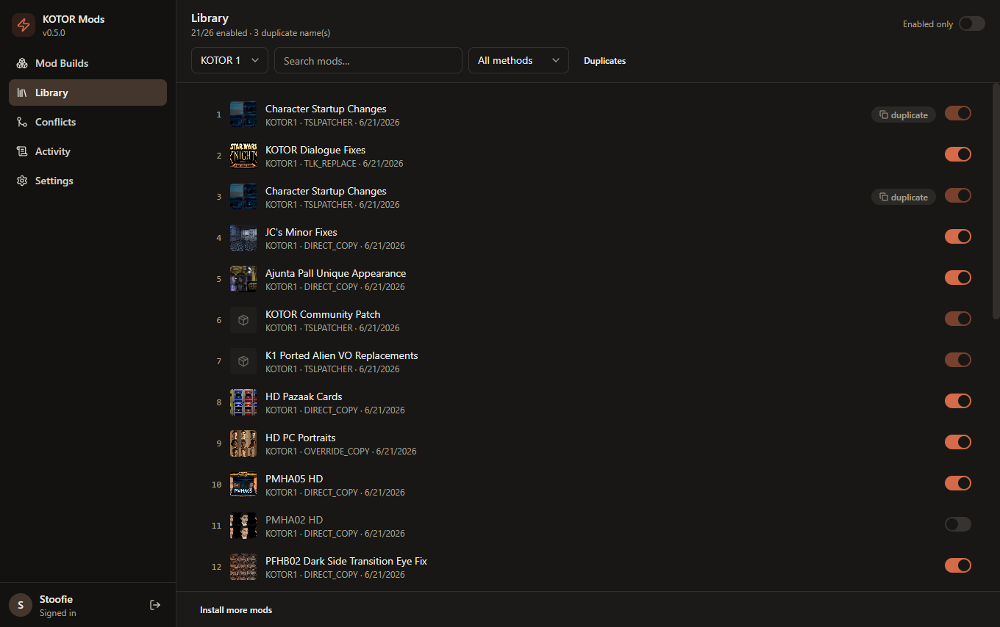
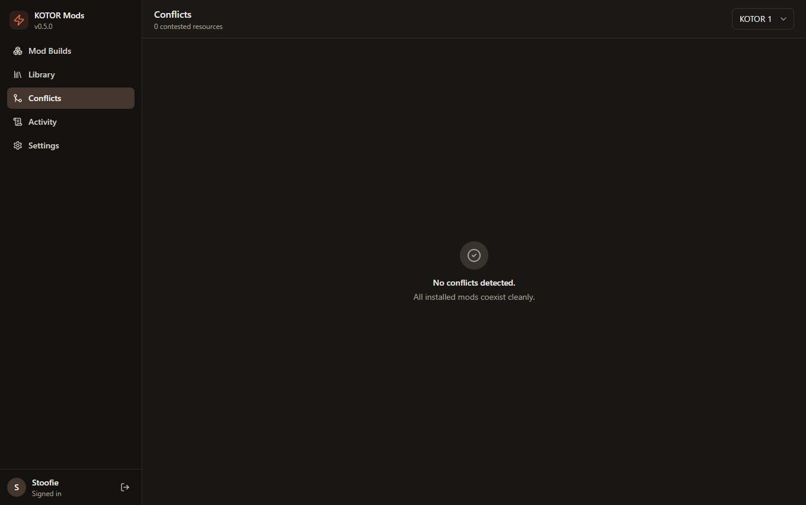
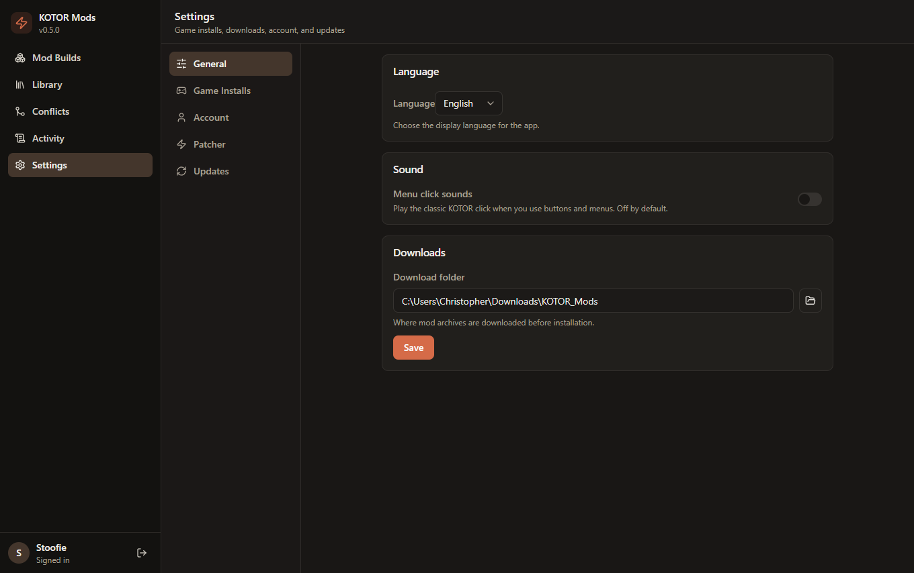
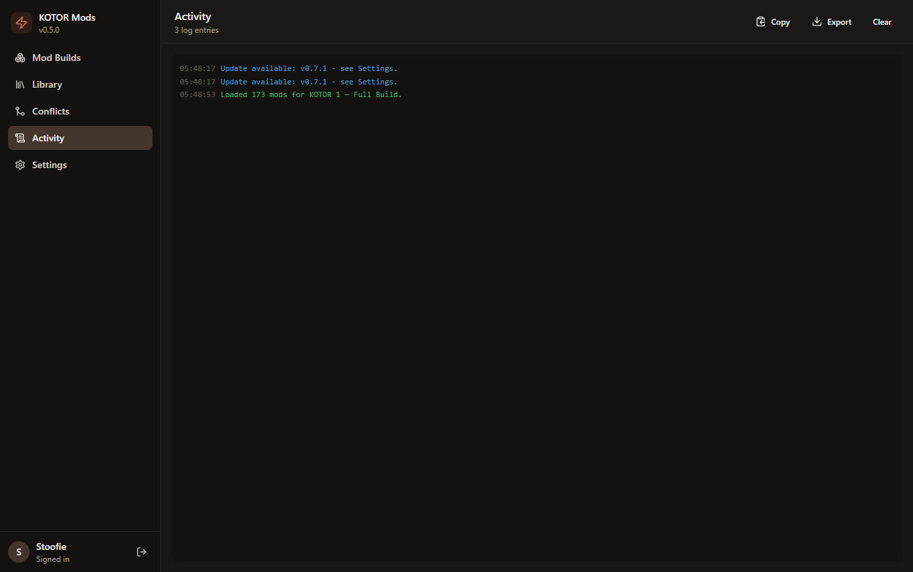

# KOTOR Mod Installer

**Mod _Star Wars: Knights of the Old Republic_ 1 & 2 without the busywork.**
Download, install, and manage the recommended community mod builds from a single
app. Pick a build, click once, and it downloads every mod, unpacks it, works out
how each one installs, and installs them in the right order for you.

> One self-contained `.exe` for Windows. No Python, Node, or separate installer
> needed. It even checks for and installs its own updates.

<p align="center">
  <a href="docs/images/01-builds.png">
    
  </a>
</p>

<p align="center">
  <a href="../../releases/latest"><b>⬇ Download the latest version</b></a>
  &nbsp;·&nbsp;
  <a href="https://christophervr.github.io/kotor-mod-manager/"><b>Visit the project site</b></a>
</p>

---

## See it in action

A quick tour of the app: choose a build, browse your installed mods, check for
conflicts, and tweak your settings.



---

## Get started in 4 steps

You do not need to be technical. If you can install a normal program, you can use
this.

### 1. Download and open it

Grab `KOTOR-Mod-Installer.exe` from the [latest release](../../releases/latest)
and run it. That is the whole app, one file. Nothing else to install.

### 2. Point it at your games and sign in

Open **Settings → Game Installs** and tell it where KOTOR 1 and/or KOTOR 2 are
installed, then sign in to your DeadlyStream account under **Account** (mods are
downloaded from your own account).

<a href="docs/images/05-game-installs.png"></a>

### 3. Pick a build and install

Go to **Mod Builds**, choose a curated build (for example *KOTOR 1 Full Build*),
click **Load Mod List**, then **Download & Install**. Mods download and install in
the recommended order with live progress. TSLPatcher mods are applied
automatically, with no clicking through each one.

<a href="docs/images/01-builds.png"></a>

### 4. Manage your library

The **Library** lists every installed mod with a thumbnail. Search and filter,
flip a switch to turn a mod on or off, spot duplicates, and import any mod archive
you like, not just the curated ones.



---

## What you get

|  |  |
|---|---|
| 📦 **Guided builds** | Downloads the recommended community mod list in the correct install order. |
| ⚡ **Automatic TSLPatcher** | A bundled HoloPatcher engine applies TSLPatcher mods with no per-mod clicking. |
| 🔀 **Turn mods on and off** | Toggle loose-file mods on or off; the app moves their files for you. |
| ⚠️ **Conflict detection** | Finds files that two mods both change, plus mods that say they are incompatible. |
| 📥 **Import any mod** | Point it at any archive or folder; it works out the install type and tracks it. |
| 🔄 **One-click updates** | Checks GitHub for new releases and can update itself in a single click. |

### A closer look

<table>
  <tr>
    <td width="50%"><a href="docs/images/02-library.png"></a><br><sub><b>Library</b> - every installed mod, with thumbnails, search, and on/off switches.</sub></td>
    <td width="50%"><a href="docs/images/03-conflicts.png"></a><br><sub><b>Conflicts</b> - flags mods that fight over the same files before they break your game.</sub></td>
  </tr>
  <tr>
    <td width="50%"><a href="docs/images/04-settings.png"></a><br><sub><b>Settings</b> - language, sounds, download folder, account, and updates.</sub></td>
    <td width="50%"><a href="docs/images/06-activity.png"></a><br><sub><b>Activity</b> - a live log of everything the app does, with copy and export.</sub></td>
  </tr>
</table>

> 💡 Tip: on the [project site](https://christophervr.github.io/kotor-mod-manager/)
> you can click any screenshot to enlarge it.

---

## How mods are kept safe

Loose-file mods (Override, Modules, `dialog.tlk`) are fully reversible. Turning one
off moves its exact files into a per-mod store and restores them when you turn it
back on. TSLPatcher and HoloPatcher mods change shared files in place, so they are
recorded as **baked** (captured with a before/after snapshot) and flagged as not
cleanly toggleable. Conflicts are worked out from file overlap across the mods you
have enabled: two loose mods overwriting each other is a warning, two baked mods
merging is just information. Everything lives under `~/.kotor_mod_installer/`
(`library/`, `disabled/`, `backups/`).

---

## Frequently asked

**Do I need a DeadlyStream account?**
Yes. Mods are downloaded from your own authenticated account. The app bundles no
mod content of its own.

**Does it bundle anything I would otherwise have to install?**
Yes. The Python backend and the HoloPatcher engine are embedded inside the single
`.exe`. You do not download or drop in anything extra.

**Will it mess up my game?**
Loose-file mods can be turned off and fully restored. Patcher-based mods change
shared files, so those are marked as baked and are not cleanly reversible, which is
just how TSLPatcher mods work everywhere.

---

## For developers

<details>
<summary>Architecture, running from source, and building the .exe</summary>

### Architecture

```
Tauri shell (Rust, single .exe)  --embeds + spawns-->  Python backend
  React + shadcn UI                    FastAPI: REST + WebSocket
       |  http/ws 127.0.0.1:8756              |
       +-------------------------------------+
                                   pipeline / scraper / detector /
                                   patcher_strategy / mod_manager
                                   (+ bundled HoloPatcher)
```

The backend exe is **embedded inside the main `.exe`** (`include_bytes!`),
extracted to a temp dir and launched on startup, then killed on exit. The whole
app ships as one self-contained file.

- `frontend/` - Tauri v2 app (React, Vite, Tailwind, shadcn/ui). `src-tauri/` is
  the Rust shell that embeds + spawns the backend and kills it on exit.
- `backend/server.py` - FastAPI wrapper exposing the pipeline + mod manager;
  streams live status/log/progress over a WebSocket.
- `installer/`, `scraper/`, `config.py` - Python backend logic.
- `scripts/` - one-off dev/analysis scripts (not part of the app).

### The HoloPatcher shim ("dynamic patcher")

TSLPatcher has no command line, and there are many legacy builds. Rather than
patching each `TSLPatcher.exe`, the app uses **HoloPatcher**, a headless,
open-source reimplementation that reads the *identical* `tslpatchdata` /
`changes.ini` / `namespaces.ini` format. One HoloPatcher engine installs **any**
TSLPatcher mod with no GUI.

HoloPatcher is bundled inside the released exe automatically. The build fetches it
via `tools/setup_holopatcher.py` and embeds it. You can override the bundled copy
with the `KOTOR_HOLOPATCHER_EXE` environment variable or a
`tools/HoloPatcher/HoloPatcher.exe` next to the app.

### Run from source

Prerequisites: Python 3.12, Node 20+, Rust (stable).

```bash
# 1. Python backend
pip install -r requirements.txt
python tools/setup_holopatcher.py          # fetch the headless shim once
python -m backend.server --port 8756       # runs the API (leave running)

# 2. Frontend (in another terminal)
cd frontend
npm install
npm run tauri dev                          # spawns its own backend + opens the app
```

`npm run tauri dev` launches the Rust shell, which embeds + spawns the backend, so
for a pure dev loop you usually only need step 2. Run the backend manually (step 1)
when iterating on Python, or to use the UI in a plain browser at
`http://localhost:5173`. The Rust build embeds the backend exe at compile time, so
`frontend/src-tauri/binaries/kotor-backend.exe` must exist before building.

### Build the single .exe locally

```bash
# 1. Build the Python backend exe and stage it for embedding.
pip install pyinstaller
python tools/setup_holopatcher.py
pyinstaller backend.spec --noconfirm
mkdir -p frontend/src-tauri/binaries
cp dist/kotor-backend.exe frontend/src-tauri/binaries/kotor-backend.exe

# 2. Build the Tauri app - the backend is embedded into the single .exe.
cd frontend && npm install && npx tauri build
# -> frontend/src-tauri/target/release/kotor-mod-installer.exe   (one self-contained file)
```

### Versioning & releases

Versioning is automatic and driven by [Conventional Commits](https://www.conventionalcommits.org):

- Every push to `main` runs `.github/workflows/release.yml`, which uses
  [git-cliff](https://git-cliff.org) (`cliff.toml`) to compute the next semver
  (`feat:` -> minor, `fix:`/other -> patch, `BREAKING CHANGE` -> major),
  regenerate `CHANGELOG.md`, bump `installer/_version.py`, tag it, and build +
  publish the GitHub Release.
- If a push contains no release-worthy commits, no version is cut.
- Pull requests and manual runs build a validation artifact via
  `.github/workflows/build.yml` (no release).
- Both paths share `.github/workflows/_build.yml`, so CI builds match released
  ones exactly. The release bump also syncs the version into `tauri.conf.json`,
  `frontend/package.json`, and `Cargo.toml`.
- Dependencies are kept current by Dependabot (`.github/dependabot.yml`), and old
  releases are pruned weekly by `.github/workflows/prune-releases.yml` (the 5 most
  recent are kept; tags are left in place).

</details>

---

## License / disclaimer

This tool automates downloading from your own authenticated DeadlyStream account
and running mod-supplied installers. It bundles no mod content. HoloPatcher and
TSLPatcher are third-party tools owned by their respective authors.
